## Exercise 1: Configuring Azure AD Connect with AD DS

Duration:  60 minutes

In this exercise, you will be configuring [Azure AD Connect](https://docs.microsoft.com/en-us/azure/active-directory/hybrid/whatis-azure-ad-connect). With Azure Virtual Desktop, all session host VMs within the AVD tenant environment are required to be domain joined to AD DS, and the domain must be synchronized with Azure AD. To manage the synchronization of objects, you will configure Azure AD Connect on the domain controller deployed in Azure.

>**Note**: RDP access to a domain controller using a public IP address is not a best practice and is only done to simplify this lab. Better security practices such as removing the PIP, enabling just-in-time access and/or leveraging a bastion host should be applied enhance security.

**Additional Resources**

  |              |            |  
|----------|:-------------:|
| Description | Links |
| Windows Virtual Desktop Spring Update enters Public Preview |https://techcommunity.microsoft.com/t5/itops-talk-blog/windows-virtual-desktop-spring-update-enters-public-preview/ba-p/1340245|
|ARM-based model public preview) deployment walk through |https://www.christiaanbrinkhoff.com/2020/05/01/windows-virtual-desktop-technical-2020-spring-update-arm-based-model-deployment-walkthrough/#NewAzurePortal-Dashboard |
  |              |            | 

### Task 1: Connecting to the domain controller

1.  In Azure portal, click on **Resource groups** in the **Navigate** section.

    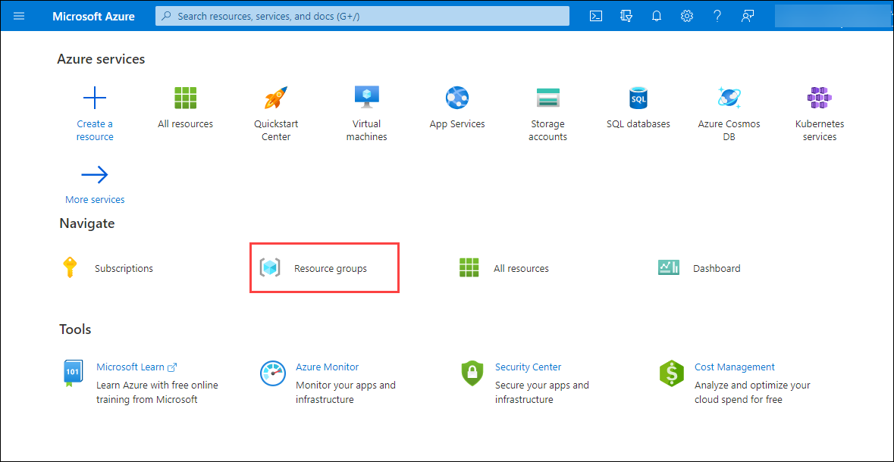

2. On the Resource Group page, open **AVD-RG** and locate the resource named **AdPubIP1** that is a Public IP address.

    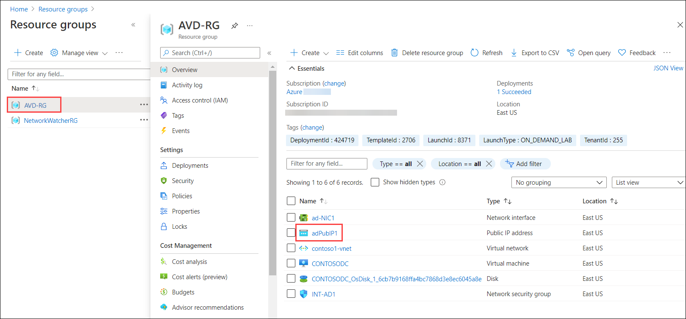
    
3. Copy the IP address given in the right side to a safe location such as in a text editor.

    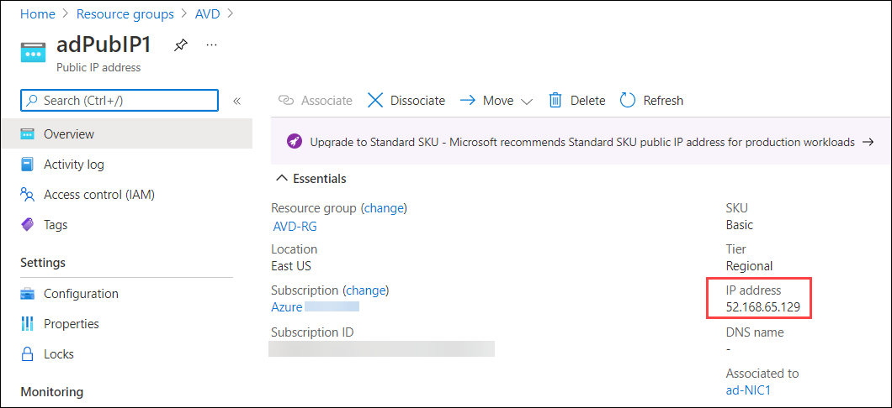

5.  On your local machine, open the **RUN** dialog window, type **MSTSC** and enter.

    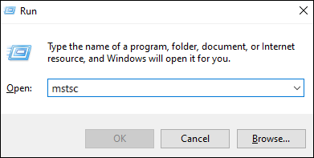 

6.  In the **Remote Desktop Connection** window, paste in the public IP address from the previous step and click on **Connect**.

     

7.  When prompted, sign in using the following credentials:

  * Username: **CONTOSO.COM\ADadmin****
  * Password: **WVD\@zureL\@b2019!**
  * When prompted, select **Yes** to accept the RDP certification warning.

### Task 2: Disabling IE Enhanced Security

To simplify tasks in this lab, we will start by disabling [IE Enhanced Security](https://docs.microsoft.com/en-us/windows-hardware/customize/desktop/unattend/microsoft-windows-ie-esc).

1.  Once connected to the domain controller, open Server Manager if it does not start automatically.

2.  In Server Manager, select **Local Server** on the left.

    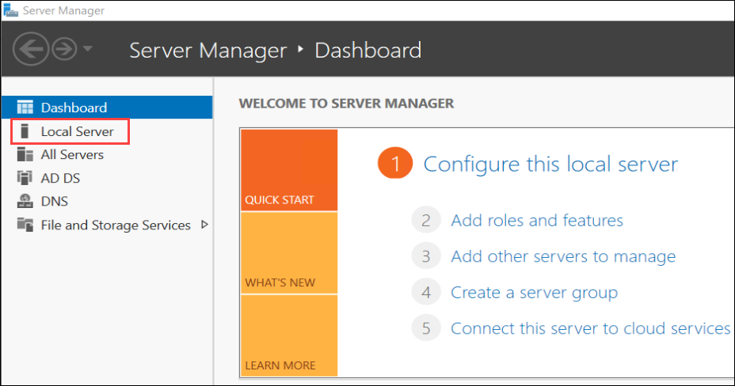

3.  Locate the **IE Enhanced Security Configuration** option and select **On**.

    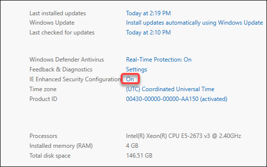 

4.  On the Internet Explorer Enhanced Security Configuration window, under **Administrators**, select the **Off** radio button and select **OK**.

    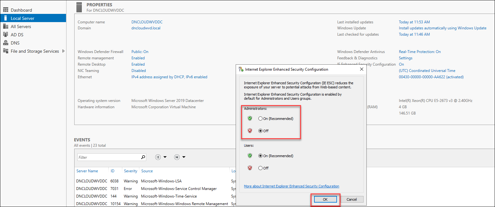

### Task 3: Creating a domain admin account

By default, Azure AD Connect does not synchronize the built-in domain administrator account [ADAdmin\@MyADDomain.com](mailto:ADAdmin@MyADDomain.com). This system account has the attribute isCriticalSystemObject set to *true*, preventing it from being synchronized. While it is possible to modify this, it is not a best practice to do so.

1.  In Server Manager, select **Tools** in the upper right corner and select **Active Directory Users and Computers**.

    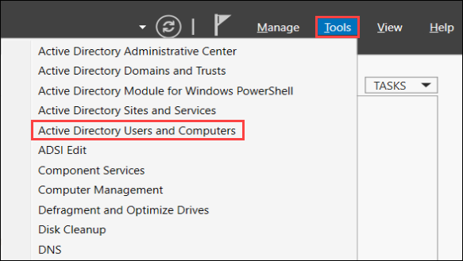 

2.  In Active Directory Users and Computers, right-click the **Users** organization unit and select **New \> User** from the menu.

     

3.  Complete the New User wizard.

    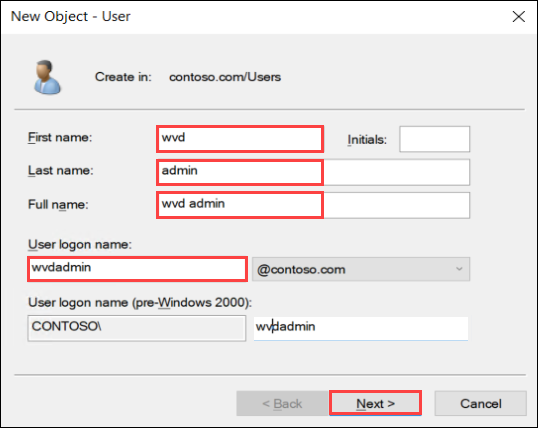

    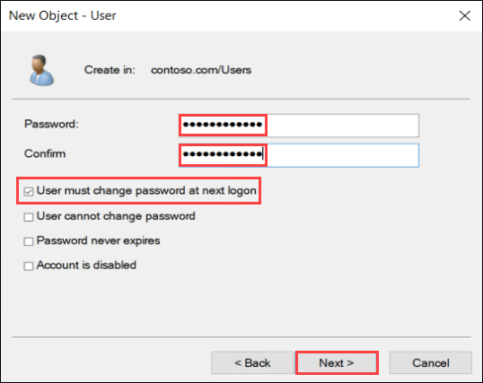 

    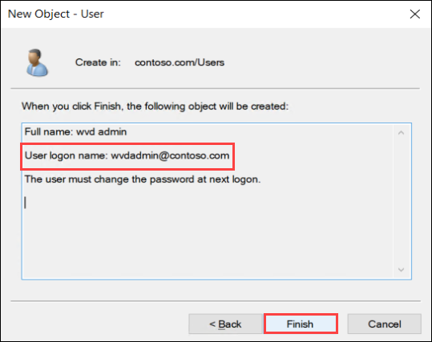

    >**Note**: This account will be important in future tasks. Make a note of the username and password you create. When setting the password, uncheck the box **User must change password at next logon**.

4. In Active Directory Users and Computers, double-click on **Users** and scroll down to the new user **wvd admin**.

    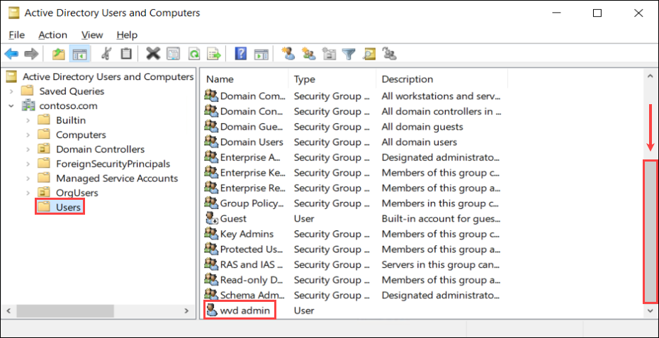

5.  Now right-click on the **wvd admin** user account and select **Add to a group**.

    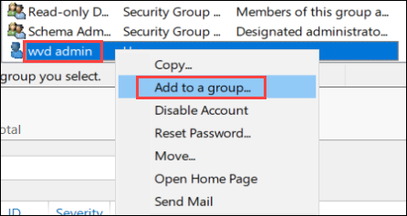

6.  On the Select Groups dialog window, type **Domain Admins**, then select **Check Names** and select **OK**.

    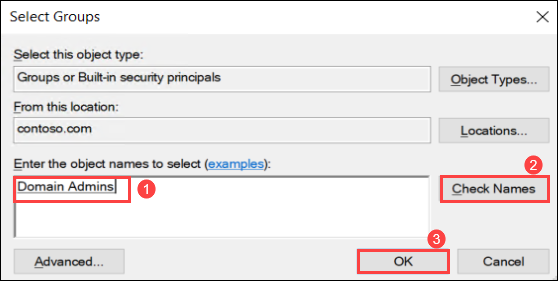

> **Note**: This account will be used during the host pool creation process for joining the hosts to the domain. Granting Domain Admin permissions will simplify the lab. However, any Active Directory account that has the following permissions will suffice. This can be done using [Active Directory Delegate Control](https://danielengberg.com/domain-join-permissions-delegate-active-directory/). 
 
7. Select **OK** on thw popup saying **The Add to Group  operation was successfully completed**.

    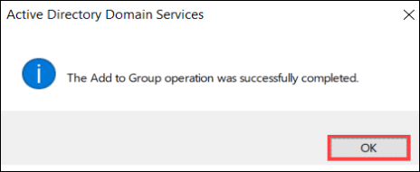

### Task 4: Configuring Azure AD Connect

1.  On the desktop of the domain controller, locate the icon for **Azure AD Connect** and open it.

    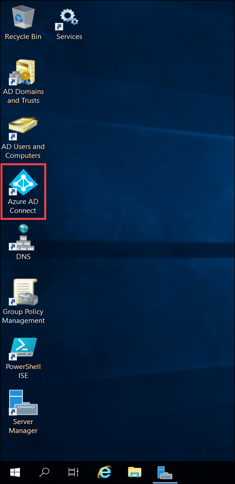

2.  Accept the license terms and privacy notice by selecting the check box and then select **Continue**. 

    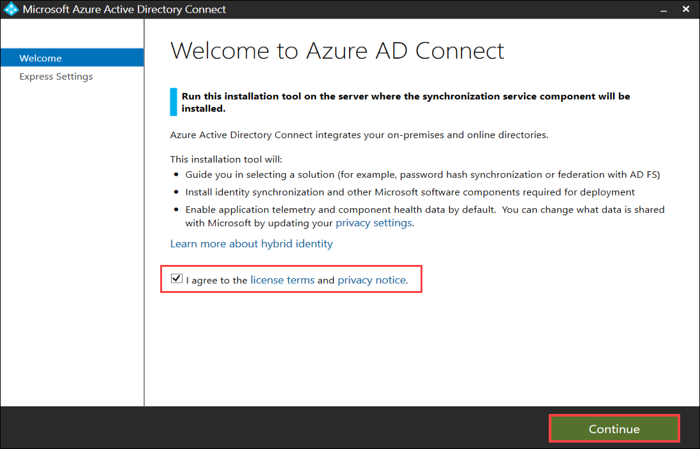

3.  On the next screen select **Use express settings**. The required components will install.

    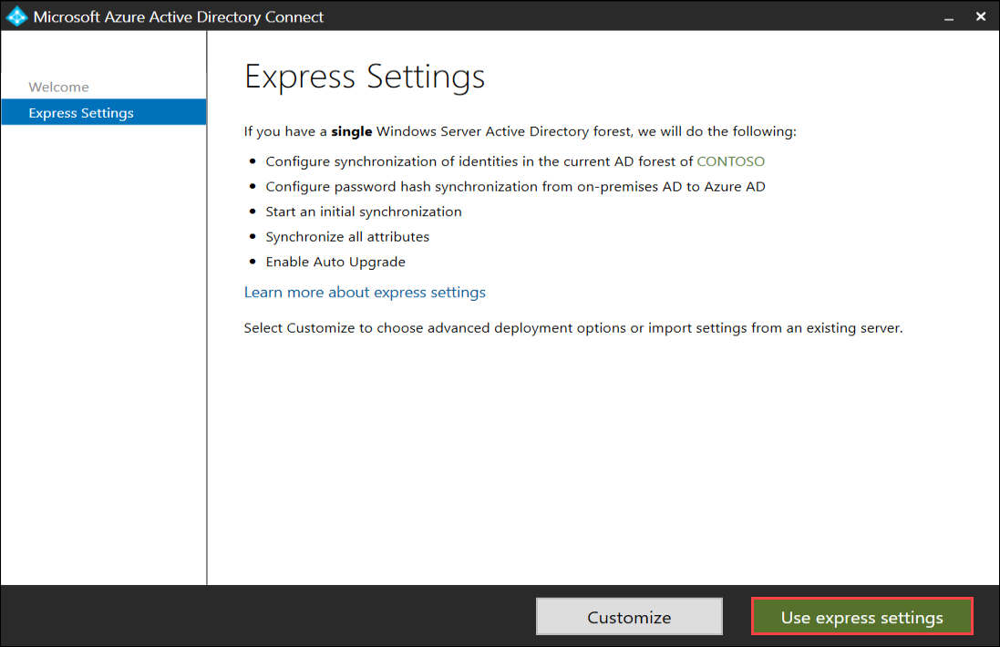 

4.  On the Connect to Azure AD page, enter in the Azure AD Global Admin credentials. 
  * Username: **<inject key="AzureAdUserEmail" />**
  * Password: **<inject key="AzureAdUserPassword" />**
  
    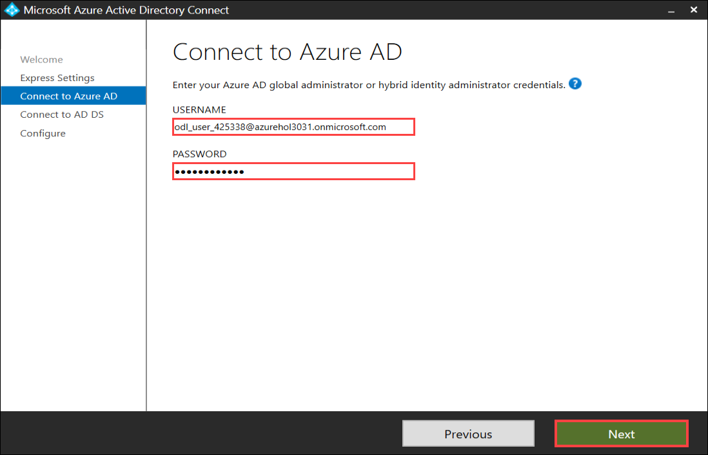

> **Note**: This is the account associated with your Azure subscription.

5.  On the Connect to AD DS page, enter the Active Directory credentials given below for the Domain Admin account and then select **Next**:
  * Username: **CONTOSO.COM\ADadmin**
  * Password: **WVD@zureL@b2019!**

    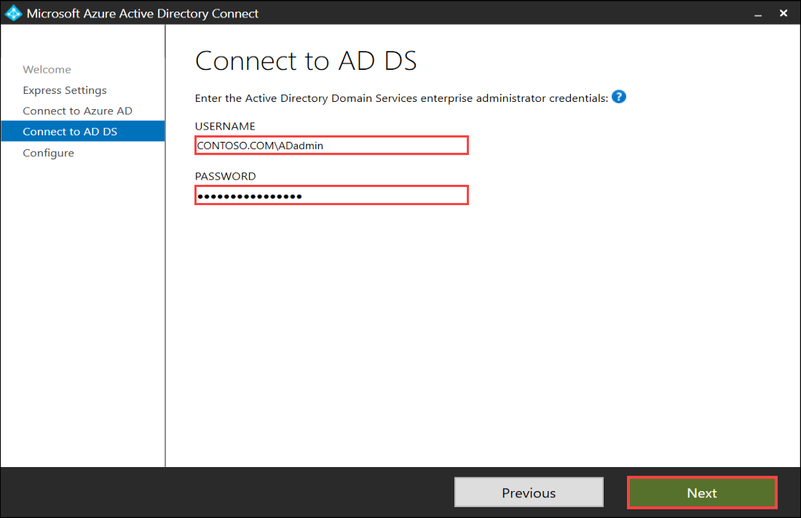
    
> **Note**: When you copy and paste the password, make sure there are no trailing spaces, as that will cause the verification to fail.

6. Select the checkbox saying **Continue without matching all UPN suffixes to verified domains**.

    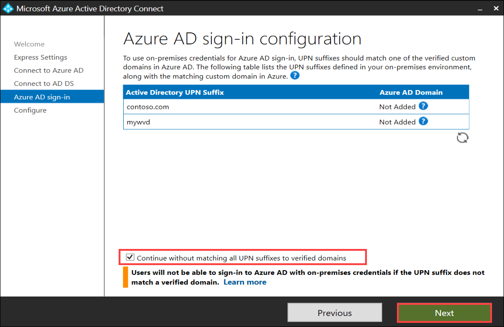

7.  Select **Install** to start the configuration and synchronization.

    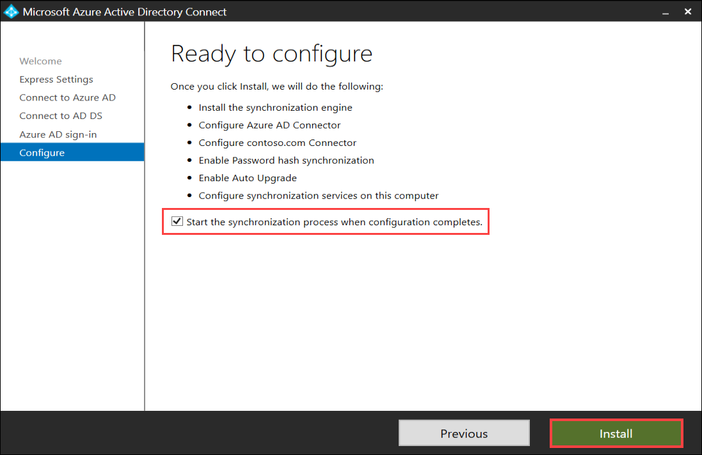

    

8.  After a few minutes, the Azure AD Connect installation will complete. Select **Exit**.

    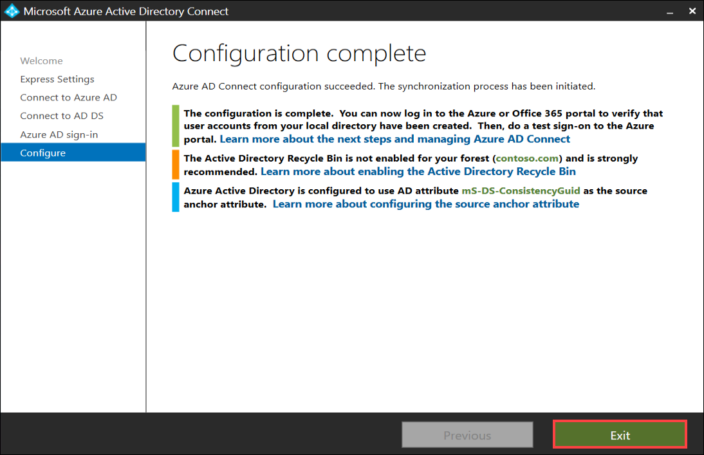
    
9.  Minimize the RDP session for the domain controller and wait a few minutes for the AD accounts to be synchronized to Azure AD.

10. Navigate to the [Azure Portal](https://portal.azure.com/). Type _Azure Active Directory_ in the search field and select **Azure Active Directory** from the list.

11. On the Azure Active Directory blade, under **Manage**, select **Users**.

    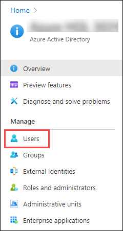

12. Review the list of user account objects and confirm the test accounts have synchronized.

    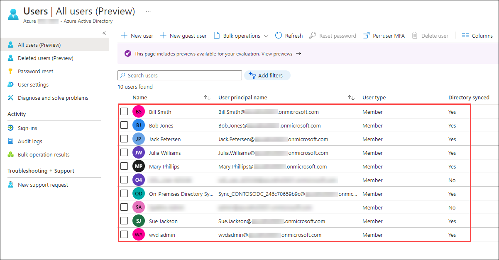

    >**Note**: It can take up to 15 minutes for the Active Directory objects to be synchronized to the Azure AD tenant.

13. Click on the **Next** button present in the bottom-right corner of this lab guide.
