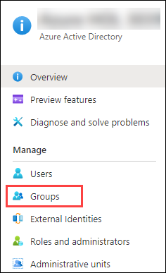
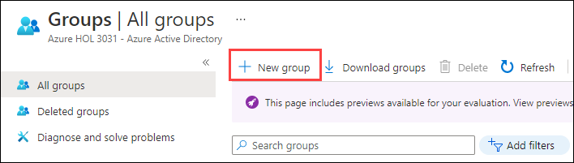
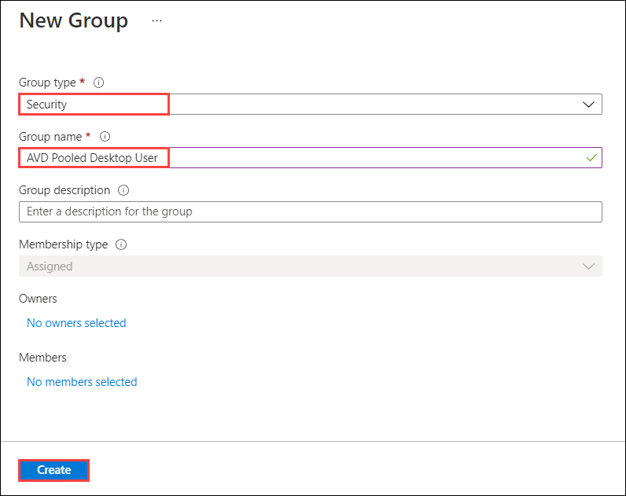
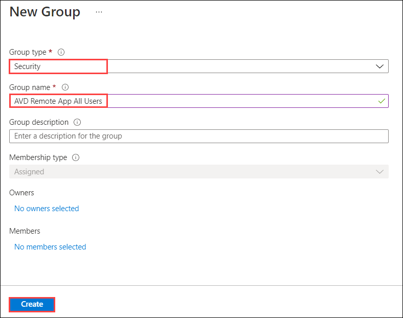
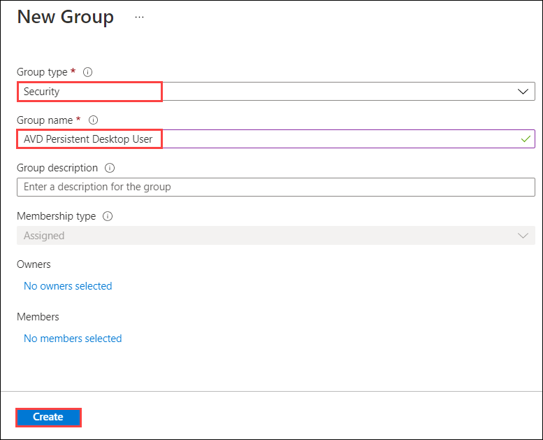
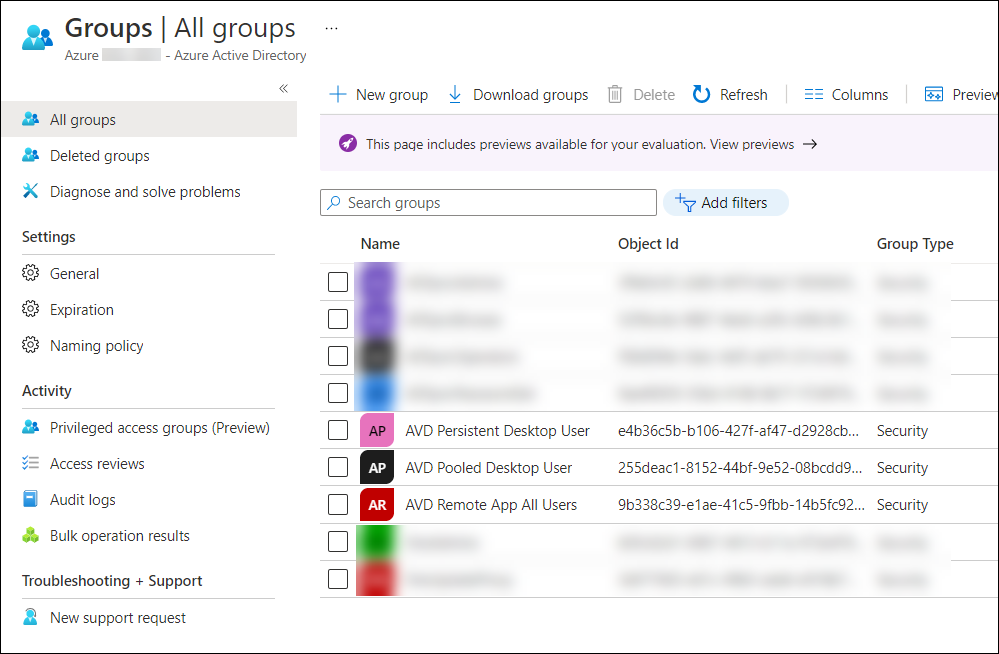
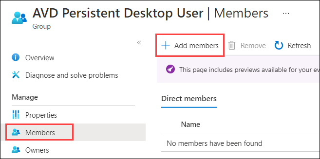
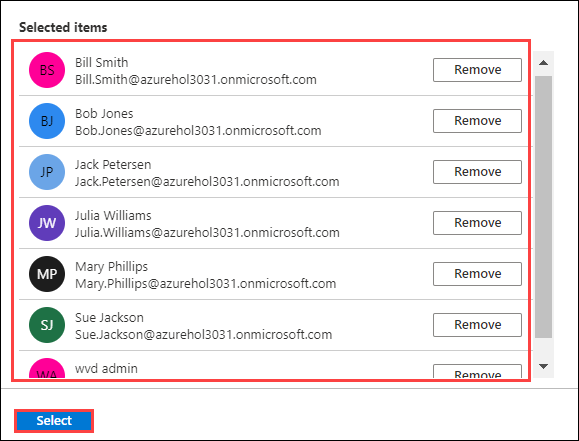

## Exercise 2: Create Azure AD groups for AVD

Duration:  30 minutes

In this exercise, you will be working with groups in Azure Active Directory (Azure AD) to assist in managing access assignment to your application groups in AVD. The new ARM portal for AVD supports access assignment using Azure AD groups. This capability greatly simplifies access management. Groups will also be leveraged in this guide to manage
share permissions in Azure Files for FSLogix.

You will be creating three Azure AD groups to manage access to the different application groups: Personal, Pooled, and RemoteApp. For this guide we will only create a single group for RemoteApps, but in a production scenario it is more common to use separate groups based on the app or persona defined by the customer. Be sure to make note of the groups you create, as they will be used in later exercises.

It is also important to keep in mind that these groups can also originate from the Windows Active Directory environment and synchronize via Azure AD Connect. This will be another common scenario for customers that already have processes defined on-premises for group management.

**Additional Resources**

  |              |            |  
|----------|:-------------:|
| Description | Links |
| Create a basic group and add members in Azure AD | https://docs.microsoft.com/en-us/azure/active-directory/fundamentals/active-directory-groups-create-azure-portal |
| Azure AD Connect sync |  https://docs.microsoft.com/en-us/azure/active-directory/hybrid/concept-azure-ad-connect-sync-user-and-contacts |
  |              |            | 

### Task 1: Creating Azure AD groups

1.  In the Azure portal, navigate to **Azure Active Directory** select **Groups** from the left pane.

    

2.  On Groups page, select **+ New group**.

    

4.  On the New Group page, fill in the following options and select **Create**.

    -    **Group type:** Security

    -    **Group name:** AVD Pooled Desktop User

    -    **Membership type:** Assigned

    

5.  Select **+ New group** again, fill in the following options and select **Create**.

    -    **Group type:** Security

    -    **Group name:** AVD Remote App All Users

    -    **Membership type:** Assigned

    

6.  Select **+ New group** again, fill in the following options and select **Create**.

    -    **Group type:** Security

    -    **Group name:** AVD Persistent Desktop User

    -    **Membership type:** Assigned

    

7. Confirm that the groups have been added by going to **Azure Active Directory**, selecting **Groups**.  Scroll down to the bottom of the list of groups and the three groups that you created should be listed.

    

### Task 2: Assign users to groups

Now that the Azure AD groups are in place, you will assign users for testing. Once the groups are populated, you can leverage them for assigning access to AVD resources once they are created.

1.  On **Groups** page, select the **AVD Persistent Desktop User** group.

2.  Select **Members** and **+ Add Members**

    

3.  In the search field, enter the name of the Users listed below, and click on the user to select them and add them to the group.

  * Bill Smith
  * Bob Jones
  * Jack Petersen
  * Julia Williams
  * Mary Phillips
  * Sue Jackson
  * wvd admin

    

4.  Repeat steps 4-6 for the **AVD Pooled Desktop User** and **AVD Remote App All Users** groups.

    At this point you have three new Azure AD groups with members assigned. Make a note of the group names and accounts you added for use later in this guide. These groups will be used to assign access to AVD application groups.

5. Click on the **Next** button present in the bottom-right corner of this lab guide.
